<h1 align="center">Sentimento Web</h1>

<p align="center">
  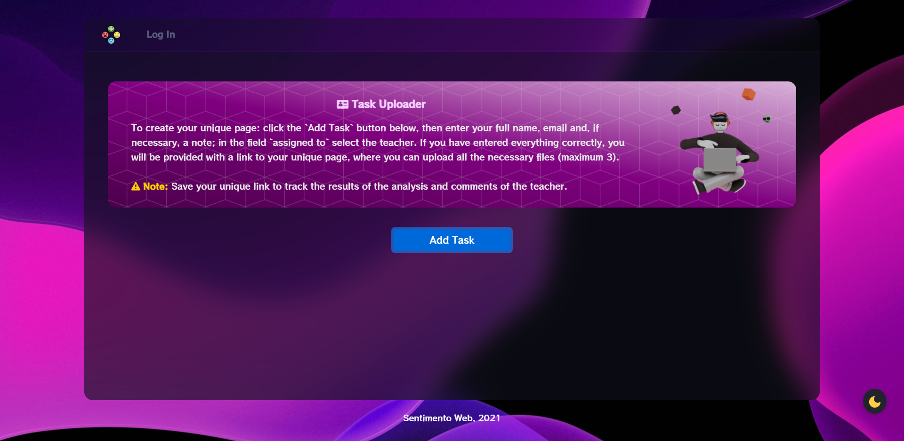
</p>

## 📋 &nbsp;Overview

This site was designed for sentiment analysis of text documents on English language. The models for sentiment analysis that were used in this project were created earlier in [this project](https://github.com/JackShen1/sentimento), where in III parts the whole process of data preparation and training of our model was described, a comparative analysis of classifiers and different models was conducted. 

In general, this application is multi-user and multi-group. Users who are not registered can fill out the form (**full name**, **email**, **note** (_optional_), **assigned_to** (_optional_)), after which will form a unique link and the user can upload their documents (maximum 3, this changes in the settings) and look at the comments from the teacher and the results of the analysis of his documents.

At least one group (configured in the Django administrator) must be created before starting, and this group must have at least one user (admin) as a member. **University** group was created in the project, and a **Motivation Letters** list was created in this group. The link to this list was used on the main page, do not forget to change it at its initial configuration.

To create a group, go to the admin tab, then select the **Groups** tab, then press **New**. To add a user to the group, go to the **Users** tab, go to your user and assign him a group.

In this application only admins (or staff users) can add or delete lists. Tasks in lists can be created by anyone, if an unregistered user is provided with a link to the list from admin. Tasks can be assigned to a specific user. Unassigned tasks are displayed as belonging to anyone.

Admins can modify the pages they received, conduct sentiment analysis of documents (_you can only upload PDF_ - the higher the estimated percentage of the result, the more positive the text), write comments, create emails, etc.


## 📝 &nbsp;Requirements

- **Django** (`v3.1+`)
- **Python** (`v3.7.10+`)
- **Keras** (`v2.4.3`)
- **Gensim** (`v3.8.3`)
- **Gunicorn** (`v19.6+`)
- **tensorflow-cpu** (`v2.1.0`)
- **h5py** (`v2.10.0`)
- **html5lib** (`v1.0.1+`)
- **NumPy** (`v1.19.5`)
- **NLTK** (`v3.5`)
- **bleach** (`v3.0.2`)
- **django-heroku** (`v0.3.1`)
- **pdfminer** (`v20191125`)
- **psycopg2** (`v2.8.6`)
- **python-decouple** (`v3.4`)
- **whitenoise** (`v5.2.0`)


## 🚀 &nbsp;How to Run

1. Clone this repository;
2. Make sure that you have all the above requirements or do the following:
	1. cd to the directory where requirements.txt is located;
	2. activate your virtualenv;
	3. run: `pip install -r requirements.txt` in your shell.
3. Enter these commands in the console:

    ```shell
    >> python manage.py makemigrations
    >> python manage.py migrate
    >> python manage.py createsuperuser
    >> python manage.py runserver
    ```
    
4. Wait until the server starts and everything is ready!


## ✨ &nbsp;Features


|                  Feature                  |               Has Access               |
|:-----------------------------------------:|:--------------------------------------:|
| Create groups and lists                   |                  **`Admin`**               |
| Create personal pages in lists            |              **`Admin + User`**            |
| See all available personal pages          |                  **`Admin`**             |
| Edit and delete personal pages            |                 **`Admin`**                 |
| Search for specific personal pages        |                  **`Admin`**             |
| Upload documents (`PDF`)                         |              **`Admin + User`**            |
| Delete documents                          | **`Admin + User (if he/she uploaded them)`** |
| Add comments                              |                 **`Admin`**               |
| Read the comments                         |             **`Admin + User`**            |
| Add personal pages in `.csv` format          |              **`Admin`**               |
| Mark personal pages completed (analyzed)  |                 **`Admin`**              |
| Conduct sentimental analysis of documents |                **`Admin`**           |
| Drag to prioritize personal pages         |                  **`Admin`**               |

## 💡 &nbsp;Additional Info

There are 5 different **LSTM** models in the project, so you can connect each of them and see how they will work (all worked almost identically).

The settings contain a couple of important config variables, let's look at their purpose.

**`ALLOW_FILE_ATTACHMENTS`** - if `True`, you can upload documents, otherwise no;

**`ALLOWED_FILE_ATTACHMENTS`** - contains a list of file extensions that can be uploaded on the server;

**`MAXIMUM_ATTACHMENT_SIZE`** - the maximum file size that can be uploaded (in bytes);

**`MAXIMUM_ATTACHMENT_FILES`** - the maximum number of files that can be added to one personal page;

**`STAFF_ONLY`** - if `True`, then only the admin with the mark **staff** will be able to perform the functions of a normal administrator, in turn, a normal administrator is equated to the user.

**NOTE:** these config variables need to be changed in the file **`defaults.py`** and in the **`settings.py`**.

🔥 To deploy the project on **Heroku**, read [this wonderful article](https://developer.mozilla.org/en-US/docs/Learn/Server-side/Django/Deployment).

## 📷 &nbsp;App Screenshots

Home Page         |  Home Page (Admin) | Add Page      |  Add Page (Admin)
:-------------------------:|:-------------------------:|:-------------------------:|:-------------------------:
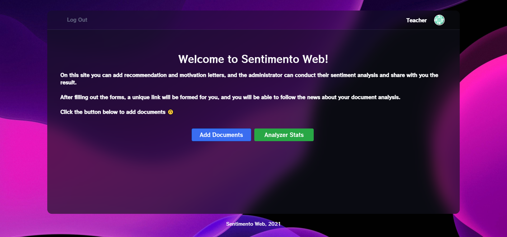 |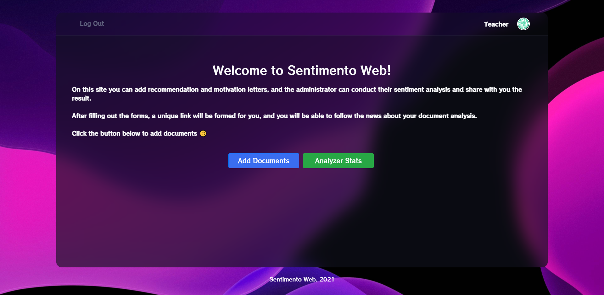| |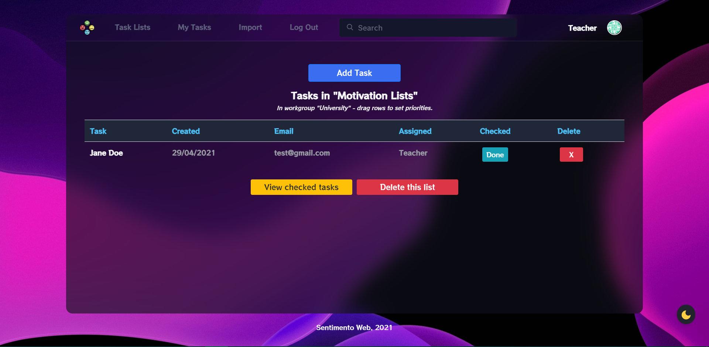

Add Page (Form)         |  Login Page  |  Personal Page    |  Personal Page (Admin)
:-------------------------:|:-------------------------:|:-------------------------:|:-------------------------:
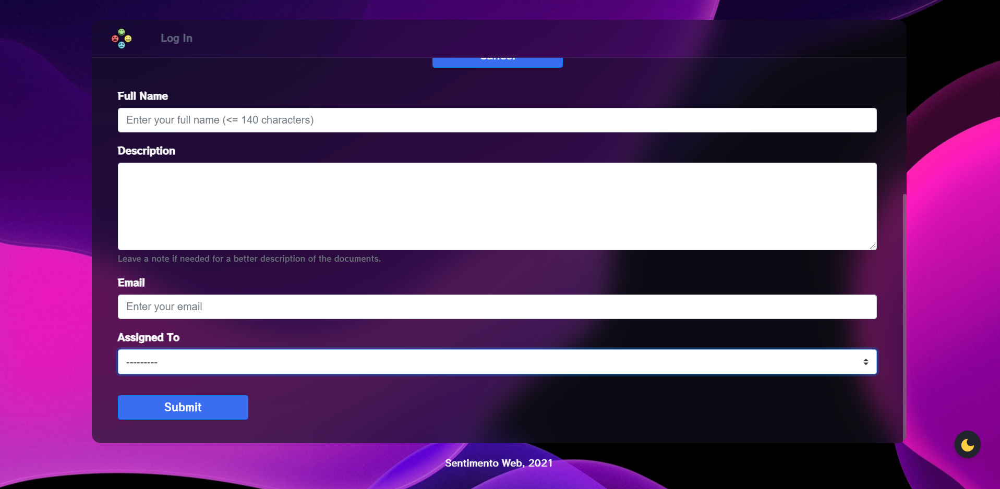 |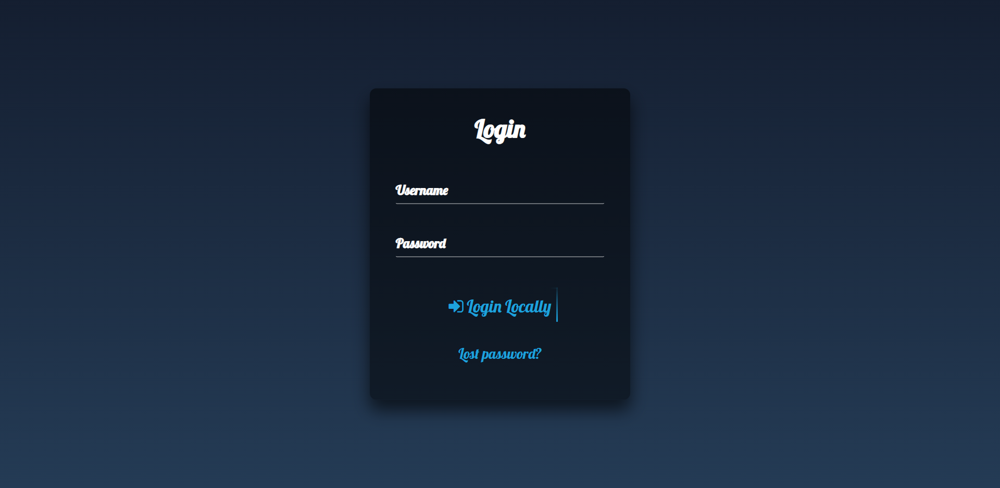|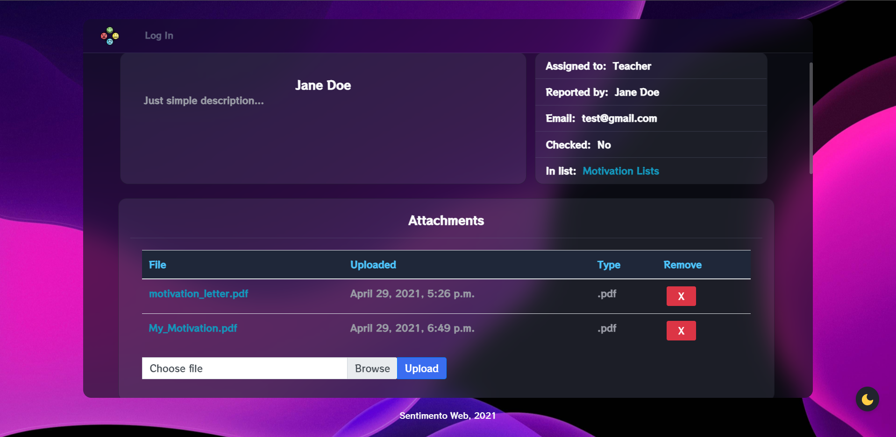 |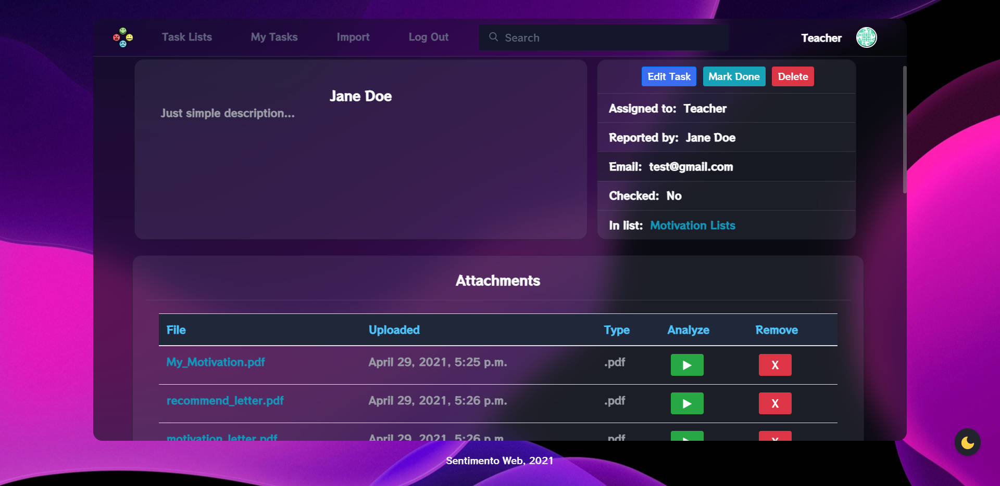

Comments        |  Search  |  Predict Page   |  Import CSV
:-------------------------:|:-------------------------:|:-------------------------:|:-------------------------:
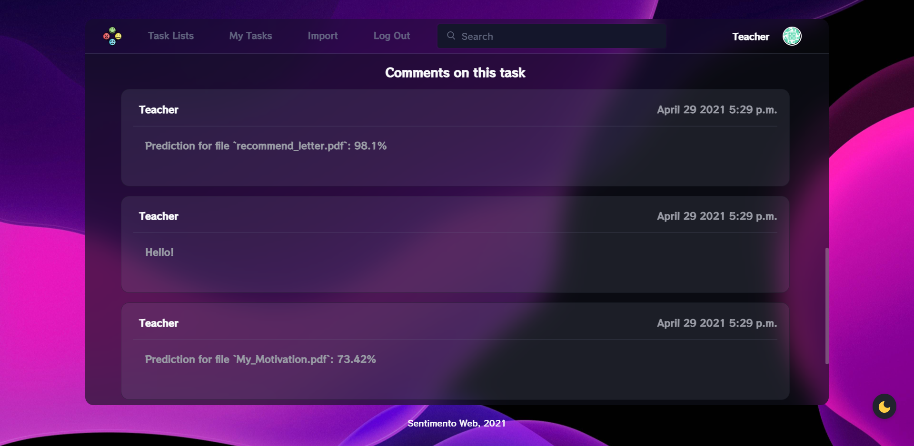 |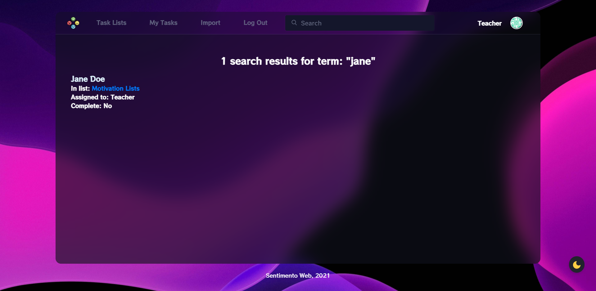|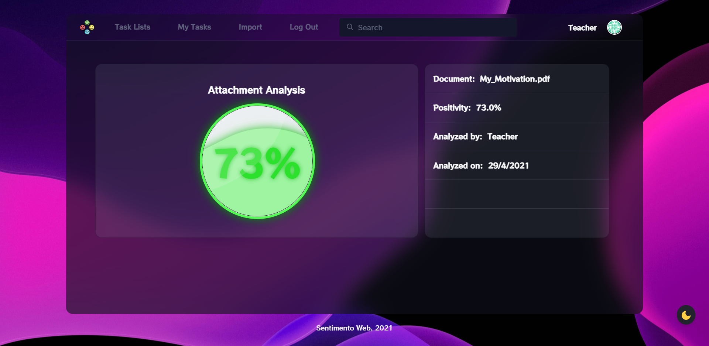 |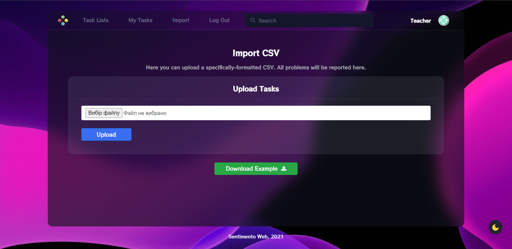

## 🎥 &nbsp;How It Works</h2>

[](https://drive.google.com/file/d/1PhL8AS2SoJSxOUXxgJGQzbegpa3F49fi/view)

## 📫 &nbsp;Get in touch

<p align="center">
<a href="https://www.linkedin.com/in/yevhenii-shendrikov-6795291b8/"></a>
<a href="mailto:jackshendrikov@gmail.com"></a>
<a href="https://www.facebook.com/jack.shendrikov"></a>
<a href=""></a>
</p>
